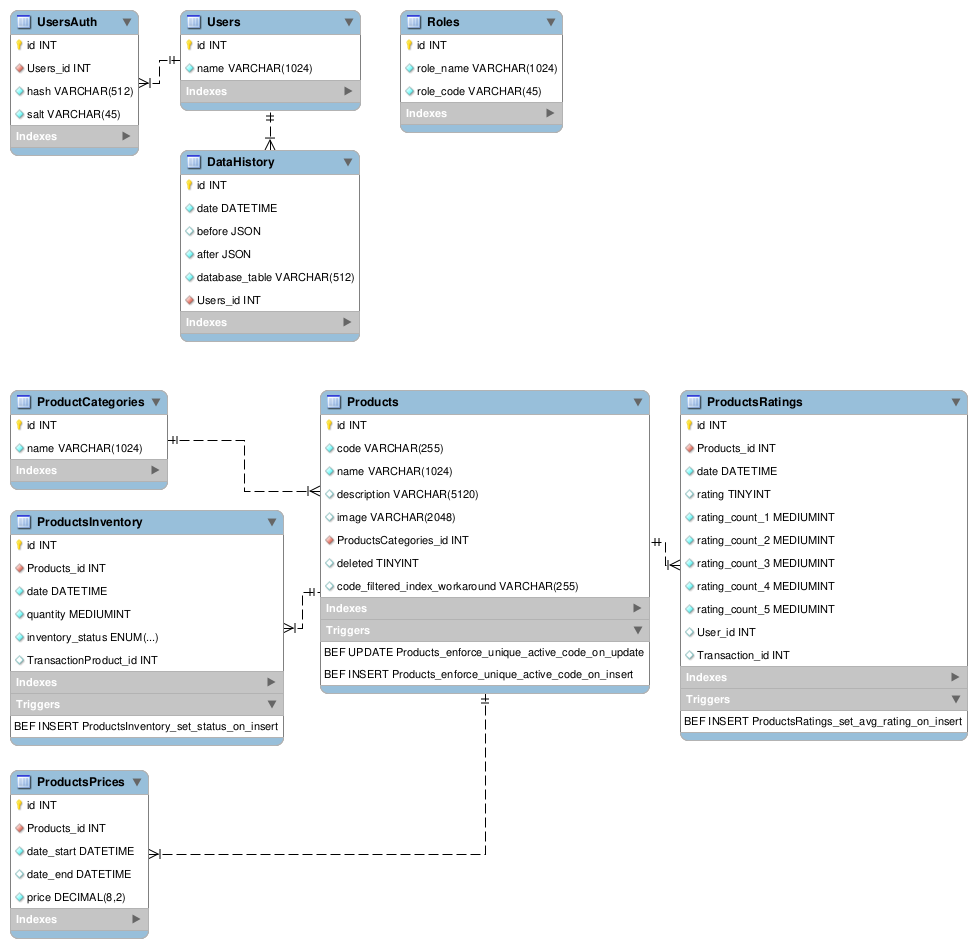

# Product Management Demo

This project's goal is to build a product management back end to showcase one's abilities to fulfill requirements but more importantly to showcase one's work ethic and methodology.

# 01 Planification

- [x] Philosophy
- [x] Select technologies
- [x] Plan deliverables
- [x] Set issues & milestones

## Philosophy & design principles

Less is more.
I prefer to work with leaner dependency trees.
I also prefer to have a simpler application structure.
My preference will show in the design and stack decisions.

Keep production dependencies as few as possible.
Build, test and scaffold developement dependencies may be more numerous.

Functions, classes and methods should be documented in the code.
Names should be as explicit as possible.

The backend design should separate concerns (~mvc).

Use proper HTTP codes for responses. No: `200 — {"error":"true"}` shenanigans.

## Requirements

The requirements already set some basic rules:

- javascript
- node.js
- express.js
- REST API
- product model and field types

## Stack decision process

### JS vs Typescript

With modern tooling it is possible to work directly in JS and have TS toolings ensure type safety using JSDoc.

Choosing JS for a smaller size project makes much more sense as it does not require a build stage and associated tooling.

We may argue that the front end is in TS and both codebases could share dependencies. In practise, it is seldom the case.

As this project is not a real life small project but a demo, it makes more sense to select TS over JS. TS trades added complexity for scalability.

Verdict: Typescript

### Dedicated linter vs code editor built in TS linter

A dedicated linter makes more sense for a larger team with varying personal preferences and looser coding rules.

As this is a demo and a smaller size project, since we already went for TS, there is no real need to install a dedicated linter like prettier.

I will personally be using VSCode TS/JS formatter.

Verdict: Built-in

### Formatting rules

Arbitrary decision:

- Semi column: [x] always [ ] only required
- Indents: [ ] tab [x] 2 spaces [ ] 4 spaces
- Name case: [x] CamelCase [ ] snake_case [ ] kebab-case
- Filename case: [ ] CamelCase [ ] snake_case [x] kebab-case
- Class vs Object: [x] CLass [ ] Object
  (Typescript prefers classes anyway)

### SQL vs NO-SQL vs SQLite vs JSON

Our data is only one table and can easily be managed inside a JSON file.

In the real world however, products most likely mean we're dealing with an inventory or sale system (or both) which means higly relational data where SQL shines over NO-SQL.
Our data model is also static which wouldn't take advantage of NO-SQL flexibility.

As for SQL vs SQLite, SQLite may be a much better choice for prototyping and early testing with only minor syntax changes when migrating to a SQL server in beta or RC.

An ORM could be a great solution to allow changing the DB system later in the development cycle. However the abstraction layer adds obfuscation and complexity that would need to be tested, less is more, no ORM.

Verdict: (possibly SQLite then) SQL

### OpenAPi / Swagger vs no tool

The benefits of using an OpenAPI tooling are many:
- clarity of the API definition
- auto generated documentation
- scaffolding
- testing
- front-end framework generation

Verdict: OpenAPI

### Test suite

Node.js built in testing library is very capable.
The functionalities it lacks at the time of this demo are not extremely important for our use case.

TS support is also really good.

Jest, vitest or mocha-chai would all be good enough choices.

Verdict: built-in

### Docker vs bare metal

Before containerization was widespread, how many times did we hear "It works on my machine."?
We already have a build process with TS, a docker buid is a one time setup addition.

Added to compose just makes startup easier especially with a SQL server.

Verdict: Docker

### Makefile

This is a personal preference/habit from complex mono repos on linux servers.
I like to use documented makefile's to control installation, development and deployment.

Verdict: makefile

### Project management & reporting

Github milestones & issues is a wonderful tool good enough for teams, a little overkill for a small project but the integration with VSCode extensions is a great experience as it allows to easily work on dedicated branches for each issue. Good planification and feature-issues improve development a lot.

Verdict: Github issues

### Github actions

Integrate CI, build & tests to Github actions for automated tests.

```yaml
# This workflow will do a clean installation of node dependencies, cache/restore them, build the source code and run tests across different versions of node
# For more information see: https://docs.github.com/en/actions/automating-builds-and-tests/building-and-testing-nodejs

name: Node.js CI

on:
  push:
    branches: [ "main" ]
  pull_request:
    branches: [ "main" ]

jobs:
  build:

    runs-on: ubuntu-latest

    strategy:
      matrix:
        node-version: [20.x, 22.x]
        # See supported Node.js release schedule at https://nodejs.org/en/about/releases/

    steps:
    - uses: actions/checkout@v4
    - name: Use Node.js ${{ matrix.node-version }}
      uses: actions/setup-node@v3
      with:
        node-version: ${{ matrix.node-version }}
        cache: 'npm'
    - run: npm ci
    - run: npm run build --if-present
    - run: npm test
```

Verdict: use actions

### SSL / HTTPS

Fairly simple to implement with a Nginx docker.
Requires the ability to generate valid SSL certificates, or, to create a private CA, self sign certificates, add certificates to the client machines. Quite a lot of hassle for a demo.

Perhaps as a nice to have or RC feature.

Verdict: TBD

### Logging

Sensible logging should happen in production.
As we work in docker we have two options:
- log to stdout and use docker logs
  - compatible with Kubernetes
  - requires setting a log driver for docker container
  - Possible option [https://docs.docker.com/config/containers/logging/configure/#configure-the-default-logging-driver](https://docs.docker.com/config/containers/logging/configure/#configure-the-default-logging-driver)
- log management in nodejs throught a mounted volume
  - winston?
  - morgan?

Verdict: Logging via docker logs + driver

### Data history

When not dealing with a genuine user request for deletion of personal data, and when volumes don't make costs prohibitive, keeping a history of all data changes is a great safeguard, allowing to rebuild a previous state of the db, audit user actions and prevent malicious or erroneous data losses.

If using a SQL server, use triggers.
Else, the Products models can call to the DataHistory model whenever performing a CRUD operation.

Verdict: Implement Data history

## Technologies

### Core stack

- [x] nodejs/express
- [ ] Java/Spring Boot
- [ ] C#/.net Core
- [ ] Python/Flask

### Others

- [x] Typescript
- [x] Built-in linter
- [x] OpenAPI tooling
- [x] Built in test library
- [x] Docker + compose
- [x] Makefile
- [x] Github actions
- [x] Https maybe
- [x] Logging

#### Database

- [ ] JSON file
- [ ] Not Only SQL
  - [ ] MongoDB
  - [ ] other: ...
- [x] SQL
  - [ ] SQLite
  - [ ] MS SQL Server
  - [ ] PostGresql
  - [ ] MariaDb
  - [ ] MySQL

#### Database abstraction

- [ ] ORM
- [x] Models
- [ ] None

## Database design

Will use MySQL Workbench for the design and generation of the database creation SQL script.

- ProductsCategory Table
  - id — int — autoincrement, primary key
  - name – varchar 1024

Yes, the exercice is clear and small, a single product table and a single user table could fulfill all the requirements.
However, we are dealing with a list of products with associated inventory and price data. It is not far fetched to imagine this application evolving into an ERM or a merchant backend. For these reasons, and because I already chose to use a SQL database, I prefer to split the data into separate tables which will allow adding more features more easily.

- Products Table
  - id — int — autoincrement, primary key
  - code — char 255 — autogen in code or with trigger
  - name — varchar 1024
  - description — varchar 5120
  - image — varchar 2048
  - category_id — int — foreign key
  - deleted — bool

ProductsPrice table is simplified. Depending on use cases, there may be needs for additional information such as: region, timezone, target group, active flag,…
In this demo, only one price will be applied at a given time, date start can be null defaulting to now, any null date end in the system will update to now when a new price is inserted.

- ProductsPrices Table
  - id — int — autoincrement, primary key
  - product_id — int — foreign key
  - date_start — datetime —
  - date_end — datetime —
  - price — decimal (5,2)

Products inventory is simplified. Unit of measurement, reasons for inventory change, 

- ProductsInventory Table
  - id — int — autoincrement, primary key
  - product_id — int — foreign key
  - date — datetime —
  - quantity — mediumint —
  - inventory_status – enum('INSTOCK','LOWSTOCK','OUTOFSTOCK')

Product rating tallies all ratings and provides a rating value.

In the real world, a customer rating table would make more sense, linking a user, a product and a purchase to the rating value. Then have cron jobs regularly update the rating value with a formula on the ratings received since the previous update.

- ProductRatings Table
  - id — int — autoincrement, primary key
  - product_id — int — foreign key
  - date — datetime —
  - rating_count_5 — mediumint —
  - rating_count_4 — mediumint —
  - rating_count_3 — mediumint —
  - rating_count_2 — mediumint —
  - rating_count_1 — mediumint —
  - rating_count_0 — mediumint —
  - rating — tinyint –


- Users Table
  - id — int — autoincrement, primary key
  - name — varchar 1024

- DataHistory Table
  - user_id – int — foreign key
  - database_table — varchar 1024 —
  - before — JSON —
  - after — JSON —
  - timestamp — datetime



[Creation script](database-creation-script.sql)

## Tasks & Deliverables

1. Complete dev setup
2. Dockerize DB server + express server (one route)
3. Implement core features & associated tests
4. Implement additional features & tests
5. Prepare RC
6. Production version

## Milestones & Issues

- [ ] 02 setup issues
- [ ] 03 core feature issues
- [ ] 04 additional feature issues
- [ ] 05 rc feature issues

# 02 Setup

## Tasks

- main branch
- [x] init git
- [x] init npm
- [x] install TS + tsconfig
- [x] install OpenAPI tools

- alpha branch
- [x] init logger
  - [x] imported library instead using winston
  - [x] back/lib/winston.ts
  - [x] back/lib/winston.test.ts
  - [x] testing standard out logs
  - [x] testing file logs
  - ~~back/middlewares/logger.ts~~
    - ~~mode from env~~
    - ~~log levels from env~~
    - ~~log file/dir from env~~
  - ~~back/middlewares/logger.test.ts~~
    ~~- test logging~~
- [x] init db
  - [x] mysql connection pool
    - back/database/connector.ts
    - back/database/connector.test.ts
  - [x] config from env
    - back/database/config.ts
    - back/database/config.test.ts
  - [x] env file
    - back/database/devdb.env
  - [x] utility to convert initial json to sql insert statement
    - back/database/products.json.to.sql.js
    - docker-entrypoint-initdb.d/002-database-state-insert.sql
  - [x] automated tests with live test db
    - back/test-db.yaml
  - [x] database creation script
    - database-model.mwb
    - docker-entrypoint-initdb.d/001-database-model.sql
  ~~- back/databases/sqlite-connection.ts~~
    ~~- [ ] import logger~~
    ~~- [ ] install sqlite3~~
    ~~- [ ] sqlite file name from env~~
    ~~- [ ] reconnect or create db~~
  ~~- back/databases/sqlite-connection.test.ts~~
    ~~- [ ] test sqlite file is created~~
  - back/server.ts
    - [x] import logger
    - [x] import db
  - back/server.test.ts
    - [x] test logs
    - [x] test db connection
    ~~- [ ] test sqlite file is created~~
- [x] init server
  - [x] openapi.yaml
  - back/server.ts
    - [x] install Express
    - [x] port ~~& domain~~ from env
    - [x] export app for tests
    - [x] conditional call to main method
      - does not call if imported
      - calls if entrypoint
  - [x] error handler
    - back/controllers/errorHandler.ts
    - back/controllers/errorHandler.test.ts
  - back/server.ts
    - [x] listen
  - [x] products route and controller
    - directly implemented a real get /products controller
      - checking relevant tasks further ahead
    - back/controllers/products-get-all.ts
      - [x] ~~dummy~~ controller --> 200
    - back/controllers/products-get-all.test.ts
      - [x] test ~~dummy~~ controller
    - back/routes/products.ts
      - [x] /products sub router
    - back/routes/products.test.ts
      - [x] test router export
  - [x] centralized router
  - back/routes/router.ts
    - [x] ~~dummy~~ route GET /products
    - [x] error handler route
    - [x] default 404 route
    - back/routes/router.test.ts
      - [x] test route exports
  - back/server.test.ts
    - ~~[ ] test listen~~
    - [x] test routes
    - [x] test error
    - [x] test 404
    - [x] test GET /products
- [x] serve
  - [x] npm script
    - npm start
  - [x] makefile script
    - make start
- [x] build
  - [x] build TS->JS into back-dist directory
  - [x] npm script
    - npm run build
  - [x] makefile script
    make build-back
  - [x] [DEPRECATED] stand alone dockerfile build of the backend
  - [x] Docker build within docker-compose
- [x] run build
  - [x] npm script
    - [DEPRECATED][TO-REFACTOR] npm run built:start
  - [x] makefile script
    - [DEPRECATED] test-built
    - make start
- [x] list categories
  - ~~[ ] update openapi.yaml~~ (prepopulated)
  - [x] Add model
    - back/Models/Categories.ts
    - [x] Categories class
      - string name
      - number id
    - [x] static method listFromDatabase
      - pass db error
    - [x] static method List (alias)
  - back/Models/Categories.test.ts
    - [x] test Categories.listFromDatabase
    - [x] test Categories.list
  - back/controllers/categories-list-all.ts
    - [x] import logger
    - [x] get list from model
    - [x] serialize to json with view
    - [x] return response
  - back/controllers/categories-list-all.test.ts
    - [x] test with db error
    - [x] test without error
  - Add route
    - [x] Add GET /categories route
      - back/routes/categories.ts
      - back/routes/router.ts
    - [x] test export GET /categories route
      - back/routes/categories.test.ts
      - back/routes/router.test.ts
  - back/server.test.ts
    - [x] test GET /categories
- [x] list products — no options, no paging
  - ~~[ ] update openapi.yaml~~ (prepopulated)
  - back/Models/Products.ts
    - [x] Products class
    - [x] static method listFromDatabase
      - [x] pass db error
    - ~~[ ] static method databaseResponseToInstance~~
      - ~~constructor throws~~
    - ~~[ ] static method databaseResponseToInstanceArray~~
    - [x] static method List (calls to databaseResponseToInstanceArray(listFromDatabase))
  - back/Models/Products.test.ts
    - ~~[ ] test new Products()~~
    - [x] test Products.listFromDatabase
    - ~~[ ] test Products.databaseResponseToInstance~~
    - ~~[ ] test Products.databaseResponseToInstanceArray~~
    - [x] test Products.List
  - [x] back/views/objectToJSON.ts
  - [x] back/views/objectToJSON.test.ts
  - ~~back/views/Products.ts~~
    - ~~[ ] toJSON~~
    - ~~[ ] listArrayToJSON~~
  - ~~back/views/Products.test.ts~~
    - ~~[ ] test toJSON~~
    - ~~[ ] test listArrayToJSON~~
  - back/controllers/products-list-all.ts
    - [x] import logger
    - [x] get list from model
    - [x] serialize to json with view
    - [x] return response
  - back/controllers/products-list-all.test.ts
    - [x] test with db error
    - [x] test withouterror
    - ~~[ ] test empty list~~
    - ~~[ ] test malformed list~~
    - ~~[ ] test valid list~~
  - update tests
    - [x] back/routes/products.test.ts
    - [x] back/routes/router.test.ts
    - [x] back/server.test.ts
- [x] view product by id
  - [x] Add Id model
    - back/models/Id.ts
    - [x] Id.validator static method
    - back/models/Id.test.ts
    - [x] Id.validator tests
  - [x] Add Products.getById static method
    - back/Models/Products.ts
    - [x] static method getFromDatabaseById
      - pass db error
    - [x] static method getById (calls to databaseResponseToInstance(getFromDatabaseById))
    - back/Models/Products.test.ts
    - [x] test Products.getFromDatabaseById
    - [x] test Products.getById
  - [x] URL param mw validation
    - back/middleware/param-id.ts
    - back/middleware/param-id.test.ts
    - [x] add mw to router
      - back/routes/router.ts
  - [x] Controller
    - back/controllers/products-get-one-by-id.ts
    - [x] import logger
    - [x] get one product from model by id
    - [x] serialize to json with view
    - [x] return response
    - back/controllers/products-get-one-by-id.test.ts
      - [x] test no id
      - [x] test unknown/deleted id
      - [x] test valid id
  - [x] add GET /products/:id route
    - back/routes/products.ts
    - [x] Add GET /products/{id} route
    - back/routes/products.test.ts
    - [x] test export GET /products/{id} route
  - ~~[ ] update openapi.yaml~~
  - back/server.test.ts
    - [x] test GET /products/{id}
- [ ] create new product
  - [x] Common validators
    - back/lib/validators.ts
    - back/lib/validators.test.ts
  - [x] Model
    - back/Models/Products.ts
      - [x] category exists
      - [x] return product
      - [x] Unique code
        - ~~static method ensureUniqueActiveCode~~
        - ~~stored procedure in mysql~~
        - MYSQL doesn't have filtered indexes
        - Function indexes exists but cannot be stored with the table in mysql workbench
        - [x] Using aggregation column with index as workaround
        - [x] Using insert and update triggers to populate the aggregation column
          - same value as `code` when `deleted` = 0
          - null when `deleted` = 1
      - [x] constructor
        - validates object properties
        - ~~ensure code is unique among active products~~
        - initialises isSaved=false instance without id
        - initialises isSaved=true instance without id
        - readonly rating
      - [x] static method insertNewToDatabase
        - pass db error
        - calls updateInDatabase when id does not exist
      - [x] static method updateInDatabase
        - pass db error
      - [x] method save (calls to insertNewToDatabase)
    - back/Models/Products.test.ts
      - [x] test new Products()
      - [x] test Products.insertNewToDatabase
      - [x] test save
  - [ ] Controller
    - back/controllers/products-create.ts
      - [x] import logger
      - [x] validate post data with model
      - [x] 422 if invalid data
      - [x] 409 if code exists among active products
      - [x] 409 if category does not exist
      - [x] save product to db with model
      - [x] serialize to json with view
      - [x] return response
    - back/controllers/products-create.test.ts
      - [x] test invalid form
      - [x] test existing code
      - [x] test valid code
  - [x] Route
    - [x] update back/routes/products.ts
    - [x] update test back/routes/products.test.ts
  - [x] Test updates
    - back/router.test.ts
      - [x] test export POST /products route
    - back/server.test.ts
      - [x] test endpoint
  - [x] update openapi.yaml
- [x] update product
  - [x] DB update
    - [x] indexes
    - [x] update_product procedure
  - [x] Model
    - back/Models/Products.ts
      - ~~[ ] static method databaseResponseToInstance~~
        - ~~constructor throws~~
      - [x] updatedFields property & tracking
      - [x] getter isUpdated
      - [x] method setUpdated ~~updateField~~
        - integrated with field setters
        - ~~validates one field value~~
        - ~~f field is code, ensures code is unique among active products~~
        - ~~update instance field value when new~~
        - ~~add key to updated fields when new~~
      - [x] update method
      - [x] static updateInDatabase method
        - call procedure for rollback
    - back/Models/Products.test.ts
      - [ ] ~~test Products.databaseResponseToInstance~~
      - [ ] ~~test Products.updateField~~
      - [x] test save updated
      - [x] test updatedInDb
  - [x] Controller
    - back/controllers/products-update-by-id.ts
      - [x] import logger
      - [x] get product ~~with model~~ from mw
      - [x] 404 if not found
      - [x] update fields with model
      - [x] 422 if invalid data
      - [x] 409 if code exists among active products
      - [x] save product to db with model
      - [x] serialize to json with view
      - [x] return response
    - back/controllers/products-update-by-id.test.ts
      - [x] test invalid form
      - [x] test valid data
  - [x] Routes
    - back/routes/products.ts
      - [x] Add PATCH /products/{id} route
    - back/routes/products.test.ts
  - [x] Test updates
    - back/router.test.ts
      - [x] test export PATCH /products/{id} route
    - back/server.test.ts
      - [x] test endpoint
  - ~~[ ] update openapi.yaml~~
- [ ] delete product
  - [x] Model
    - back/Models/Products.ts
      - [x] static method setDeletedInDatabase
      - [x] static method deleteById calls updateAsDeletedInDatabaseById
        - pass db error
      - [x] method delete
    - back/Models/Products.test.ts
      - [x] test Products.updateAsDeletedInDatabaseById
      - [x] test Products.deleteById
  - [x] Controller
    - back/controllers/products-delete-by-id.ts
      - [x] import logger
      - [x] call delete by id with model
      - [x] 404 if not found
      - [x] 500 if error
      - [x] return 204 response
    - back/controllers/products-delete-by-id.test.ts
      - [x] test missing id
      - [x] test valid id
  - [x] Routes
    - back/routes/products.ts
      - [x] Add DELETE /products/{id} route
    - back/routes/products.test.ts
  - [x] Test updates
    - back/router.test.ts
      - [x] test export DELETE /products/{id} route
    - back/server.test.ts
      - [x] test endpoint
  - ~~[ ] update openapi.yaml~~
- merge main branch

- beta roles branch
- [ ] list roles
  - [ ] Model
    - back/Models/Roles.ts
      - [ ] Roles class
        - string name
        - number id
      - [ ] static method listFromDatabase
        - pass db error
      - [ ] static method databaseResponseToInstance
        - constructor throws
      - [ ] static method databaseResponseToInstanceArray
      - [ ] static method List (calls to databaseResponseToInstanceArray(listFromDatabase))
    - back/Models/Roles.test.ts
      - [ ] test new Roles()
      - [ ] test Roles.listFromDatabase
      - [ ] test Roles.databaseResponseToInstance
      - [ ] test Roles.databaseResponseToInstanceArray
      - [ ] test Roles.List
  - [ ] Controller
    - back/controllers/roles-list-all.ts
      - [ ] import logger
      - [ ] get list from model
      - [ ] serialize to json with view
      - [ ] return response
    - back/controllers/roles-list-all.test.ts
      - [ ] test empty list
      - [ ] test malformed list
      - [ ] test valid list
  - [ ] Routes
    - back/routes/roles.ts
      - [ ] Add GET /roles route
    - back/routes/roles.test.ts
  - [ ] Test updates
    - back/router.test.ts
      - [ ] test export GET /roles route
    - back/server.test.ts
      - [ ] test GET /roles
  - [ ] update openapi.yaml
- [ ] list users
  - [ ] Model
    - back/Models/Users.ts
      - [ ] Users class
      - [ ] static method listFromDatabase
        - pass db error
      - [ ] static method databaseResponseToInstance
        - constructor throws
      - [ ] static method databaseResponseToInstanceArray
      - [ ] static method List (calls to databaseResponseToInstanceArray(listFromDatabase))
    - back/Models/Products.test.ts
      - [ ] test new Products()
      - [ ] test Products.listFromDatabase
      - [ ] test Products.databaseResponseToInstance
      - [ ] test Products.databaseResponseToInstanceArray
      - [ ] test Products.List
  - [ ] Controller
    - back/controllers/products-list-all.ts
      - [ ] import logger
      - [ ] get list from model
      - [ ] serialize to json with view
      - [ ] return response
    - back/controllers/products-list-all.test.ts
      - [ ] test empty list
      - [ ] test malformed list
      - [ ] test valid list
  - [ ] Routes
  - [ ] Test updates
    - back/routes/router.test.ts
      - [ ] test exports GET /users route
    - back/server.test.ts
      - [ ] update test GET /users
  - [ ] update openapi.yaml
- [ ] login mockup
  - [ ] Model
    - back/models/Users.ts
      - [ ] static method getByName
    - back/models/Users.test.ts
      - [ ] test getByName
  - [ ] Controller
    - back/controllers/login.ts
      - [ ] getByName using sanitized post data
      - [ ] 501 if not found
      - [ ] serialize response using view
      - [ ] set user id in session cookie
      - [ ] return payload
    - back/controllers/login.test.ts
      - [ ] test unknown name
      - [ ] test valid name
  - [ ] Routes
    - back/routes/users.ts
      - [ ] add POST /login route
    - back/routes/users.test.ts
  - [ ] Test updates
    - back/router.test.ts
      - [ ] test export POST /login route
    - back/server.test.ts
      - [ ] test endpoint
  - [ ] update openapi.yaml
- [ ] secure auth only routes
  - back/middlewares/security-auth.ts
    - [ ] test req for session cookie & user id
  - back/middlewares/security-auth.test.ts
    - [ ] test mw
  - back/router.ts
    - [ ] POST /products
    - [ ] PATCH /products/{id}
    - [ ] DELETE /products/{id}
  - back/router.test.ts
    - [ ] test export updates
  - back/controllers/products-create.test.ts
    - [ ] update test with auth cases
  - back/controllers/products-update.test.ts
    - [ ] update test with auth cases
  - back/controllers/products-delete.test.ts
    - [ ] update test with auth cases
  - back/server.test.ts
    - [ ] update test with auth cases
- [ ] secure routes by roles
  - back/controllers/login.ts
    - [ ] list user roles using model
    - [ ] set user roles in session cookie
    - [ ] return payload
  - back/controllers/login.test.ts
    - [ ] test user roles in cookie
  - back/middlewares/security-role.ts
    - [ ] check roles in session cookie vs mw init role
  - back/middlewares/security-role.test.ts
    - [ ] test mw
  - back/router.ts
    - [ ] POST /products
    - [ ] PATCH /products/{id}
    - [ ] DELETE /products/{id}
  - back/router.test.ts
    - [ ] test export updates
  - back/controllers/products-create.test.ts
    - [ ] update test with role cases
  - back/controllers/products-update.test.ts
    - [ ] update test with role cases
  - back/controllers/products-delete.test.ts
    - [ ] update test with role cases
  - back/server.test.ts
    - [ ] update test with role cases
- merge main branch

- beta sql branch
- [x] ~~switch sqlite to~~ mysql
  - [x] dockerized db
    - back/test-db.yaml
    - docker-compose.yaml
    - [x] database container
    - [x] config from env/secret
  - ~~back/makefile~~
    - ~~[ ] update with db from docker-compose~~
  - ~~back/package.json~~
    - ~~[ ] update with db from docker-compose~~
  - ~~back/databases/sqlite-connection.ts~~
    - ~~[ ] remove file~~
  - ~~back/databases/sqlite-connection.test.ts~~
    - ~~[ ] remove file~~
  - ~~back/databases/sql-connection.ts~~
    - ~~[ ] import mysql library~~
    - ~~[ ] auth from env/secret~~
  - ~~back/databases/sql-connection.test.ts~~
    ~~- [ ] test connection~~
  - ~~back/models/*~~
    ~~- [ ] convert SQL syntax from sqlite to mysql~~
- [ ] automated CI/CD github tests
  - [ ] update docker-compose.yaml
  - [ ] add necessary Dockerfiles
  - .github/workflows/test-with-db.yaml
    - [ ] configure testing env & cmd
  - [ ] test on github
- [ ] db offline failsafe
  - back/middlewares/failsafe-db-offline.ts
    - [ ] test db connection status
    - [ ] returns 503 if offline
  - back/middlewares/failsafe-db-offline.test.ts
    - [ ] test mw
  - back/server.ts
    - [ ] use mw for all
  - back/server.test.ts
    - [ ] add db offline test
- merge main branch

- beta data history branch
- [ ] save data history
  - back/models/DataHistory.ts
    - [ ] DataHistory class
    - [ ] static method log inserts to db
  - back/models/DataHistory.test.ts
    - [ ] test log
  - back/models/Products.ts
    - [ ] update to call to DataHistory.log
  - back/models/Products.test.ts
    - [ ] test call to DataHistory.log
- [ ] list data history
  - [ ] update openapi.yaml
  - back/router.ts
    - [ ] add POST /data-history
    - [ ] mw: auth, role
  - back/router.test.ts
    - [ ] test exported route
  - back/models/DataHistory.ts
    - [ ] static method list
  - back/models/DataHistory.test.ts
    - [ ] test list
  - back/views/DataHistory.ts
    - [ ] static method toJSON
    - [ ] static method listToJSONArray
  - back/views/DataHistory.test.ts
    - [ ] test list to JSONArray
  - back/controllers/data-history-list.ts
    - [ ] list using model
    - [ ] serialize using view
    - [ ] return payload
  - back/controllers/data-history-list.test.ts
    - [ ] test controller
  - back/server.test.ts
    - [ ] add list data history test
- merge main branch

# 03 Core features

- [ ] GET /products
  - [x] Server initializes db connection (using secrets)
  - [x] Server listens to port
  - [x] Server default route --> 404
  - [ ] Server mw: failsafe when db offline --> 503
  - [x] Product model can select from db
  - [ ] DataHistory model can insert to db
  - [x] Product model can serialize db response into JSON
  - [x] Server route for GET /products
  - [x] Server controller for route
    - empty result is not an error
    - on applicative error --> 500
    - query db throught model
    - serializes response throught view
    - return response --> 200
    - [ ] Rate limiter on PROXY?
- [ ] POST /products
  - [ ] Server mw: auth not logged --> 401
  - [ ] Server mw: role not matched --> 403
  - [ ] Product model can validate fields
    - invalid --> 422
  - [ ] Product model can insert to db
  - [ ] Product model can serialize db response into JSON
  - [ ] Server route for POST /products
  - [ ] Server controller for route
    - on applicative error --> 500
    - insert db throught model
    - (should not happen) exists error --> 409
    - serializes response throught view
    - return response --> 201
- [ ] GET /products/{id}
  - [ ] Server route for GET /products/{id}
  - [ ] Server controller for route
    - empty result is an error --> 404
    - on applicative error --> 500
    - query db throught model
    - serializes response throught view
    - return response --> 200
- [ ] PATCH /products/{id}
  - [ ] Server mw: auth not logged --> 401
  - [ ] Server mw: role not matched --> 403
  - [ ] Product model can validate patch fields
    - invalid --> 422
  - [ ] Product model can update in db
  - [ ] Product model can serialize db response into JSON
  - [ ] Server route for PATCH /products/{id}
  - [ ] Server controller for route
    - on applicative error --> 500
    - update db throught model
    - serializes response throught view
    - return response --> 201
- [ ] DELETE /products/{id}
  - [ ] Server mw: auth not logged --> 401
  - [ ] Server mw: role not matched --> 403
  - [ ] Product model can update as removed in db
  - [ ] Server route for DELETE /products/{id}
  - [ ] Server controller for route
    - on applicative error --> 500
    - update db throught model: deleted flag + date
    - return response --> 204
      or 202 if async and queued
- [ ] Branch & version appropriately

# 04 Nice to have features

- [ ] Offline DB failsafe
  - [ ] mw: offline db failsafe: 
    - checks for db connection status
    - if connection is down --> 503
- [ ] DataHistory implementation
  - [ ] Through code
    - [ ] DataHistory can insert to db
    - [ ] Products model calls to DataHistory on every CRUD operation
  - [ ] Using triggers
- [ ] GET /products/changes
  - [ ] Server mw: auth not logged --> 401
  - [ ] Server mw: role not matched --> 403
  - [ ] DataHistory can read db records
  - [ ] Server route for DELETE /products/{id}
    - empty result is not an error --> 200 []
    - on applicative error --> 500
    - query db throught model
    - serializes response throught view
    - return response --> 200
- [ ] SSL Certificate for HTTPS
- [ ] Auth system
  - [ ] mw
    - [ ] auth: verify that user is logged
  - [ ] routes
    - [ ] proxy redirect to 3rd party / auth server login page
    - [ ] proxy redirect to 3rd party / auth server logout page
    - [ ] local POST /login
      - [ ] User model can interact with auth service
      - [ ] User model can validate login fields
      - [ ] server route for POST /login
        - login error --> 401
        - login success --> 200 + session/token
    - [ ] GET /logout
- [ ] RBAC system
  - [ ] mw
    - [ ] role: verify user role against route required role
  - [ ] routes

# 05 RC

When applicable

- [ ] migrate prototype env to a prod env
- [ ] harden features
  - example: [https://github.com/littlebaydigital/docker-alpine-hardened/blob/master/harden.sh](https://github.com/littlebaydigital/docker-alpine-hardened/blob/master/harden.sh)
- [ ] migrate to prod DB

# 06 Going further

- i18n
- elastic/fuzzy search: to warn users about duplicates